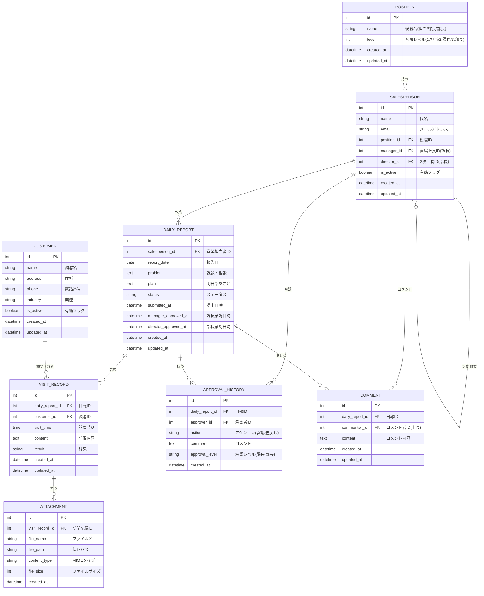

# 営業日報システム 要件定義書

## 1. システム概要

営業担当者が日次で訪問記録・課題・翌日の予定を報告し、上長が承認・コメントを行うシステム。

## 2. 機能要件

| 機能             | 説明                                |
| ---------------- | ----------------------------------- |
| **日報作成**     | 営業が日次で日報を作成・編集        |
| **訪問記録**     | 1日報につき複数の顧客訪問記録を登録 |
| **添付ファイル** | 訪問記録に資料を添付可能            |
| **Problem/Plan** | 課題・相談事項と翌日の予定を記載    |
| **上長コメント** | 上長が日報にコメントを付与          |
| **承認フロー**   | 課長→部長の2段階承認                |
| **マスタ管理**   | 顧客・営業担当者・役職のマスタ管理  |

## 3. 組織階層（2階層）

```
部長（2次上長）
  └─ 課長（1次上長）
       └─ 担当（営業）
```

## 4. 承認フロー

```
下書き → 提出済 → [課長承認] → [部長承認] → 承認完了
                      ↓              ↓
                   差戻し          差戻し
```

### ステータス遷移

| ステータス         | 説明                       | 次のアクション    |
| ------------------ | -------------------------- | ----------------- |
| `draft`            | 下書き                     | 提出              |
| `submitted`        | 提出済（課長承認待ち）     | 課長が承認/差戻し |
| `manager_approved` | 課長承認済（部長承認待ち） | 部長が承認/差戻し |
| `approved`         | 承認完了                   | -                 |
| `rejected`         | 差戻し                     | 再編集して再提出  |

## 5. エンティティ一覧

| エンティティ                    | 説明                           |
| ------------------------------- | ------------------------------ |
| **役職 (position)**             | 役職マスタ（担当/課長/部長）   |
| **営業担当者 (salesperson)**    | 営業マスタ、上長との関係を持つ |
| **顧客 (customer)**             | 顧客マスタ                     |
| **日報 (daily_report)**         | 日次の報告書本体               |
| **訪問記録 (visit_record)**     | 顧客訪問の詳細（複数行）       |
| **添付ファイル (attachment)**   | 訪問記録への添付ファイル       |
| **承認履歴 (approval_history)** | 承認・差戻しの履歴             |
| **コメント (comment)**          | 上長からのコメント             |

## 6. ER図



## 7. テーブル定義詳細

### 7.1 POSITION（役職）

| カラム名   | 型          | NULL | 説明                               |
| ---------- | ----------- | ---- | ---------------------------------- |
| id         | INT         | NO   | 主キー                             |
| name       | VARCHAR(50) | NO   | 役職名（担当/課長/部長）           |
| level      | INT         | NO   | 階層レベル（1:担当/2:課長/3:部長） |
| created_at | DATETIME    | NO   | 作成日時                           |
| updated_at | DATETIME    | NO   | 更新日時                           |

### 7.2 SALESPERSON（営業担当者）

| カラム名    | 型           | NULL | 説明                          |
| ----------- | ------------ | ---- | ----------------------------- |
| id          | INT          | NO   | 主キー                        |
| name        | VARCHAR(100) | NO   | 氏名                          |
| email       | VARCHAR(255) | NO   | メールアドレス                |
| position_id | INT          | NO   | 役職ID（FK: POSITION）        |
| manager_id  | INT          | YES  | 直属上長ID（FK: SALESPERSON） |
| director_id | INT          | YES  | 2次上長ID（FK: SALESPERSON）  |
| is_active   | BOOLEAN      | NO   | 有効フラグ                    |
| created_at  | DATETIME     | NO   | 作成日時                      |
| updated_at  | DATETIME     | NO   | 更新日時                      |

### 7.3 CUSTOMER（顧客）

| カラム名   | 型           | NULL | 説明       |
| ---------- | ------------ | ---- | ---------- |
| id         | INT          | NO   | 主キー     |
| name       | VARCHAR(200) | NO   | 顧客名     |
| address    | VARCHAR(500) | YES  | 住所       |
| phone      | VARCHAR(20)  | YES  | 電話番号   |
| industry   | VARCHAR(100) | YES  | 業種       |
| is_active  | BOOLEAN      | NO   | 有効フラグ |
| created_at | DATETIME     | NO   | 作成日時   |
| updated_at | DATETIME     | NO   | 更新日時   |

### 7.4 DAILY_REPORT（日報）

| カラム名             | 型          | NULL | 説明                            |
| -------------------- | ----------- | ---- | ------------------------------- |
| id                   | INT         | NO   | 主キー                          |
| salesperson_id       | INT         | NO   | 営業担当者ID（FK: SALESPERSON） |
| report_date          | DATE        | NO   | 報告日                          |
| problem              | TEXT        | YES  | 課題・相談                      |
| plan                 | TEXT        | YES  | 明日やること                    |
| status               | VARCHAR(20) | NO   | ステータス                      |
| submitted_at         | DATETIME    | YES  | 提出日時                        |
| manager_approved_at  | DATETIME    | YES  | 課長承認日時                    |
| director_approved_at | DATETIME    | YES  | 部長承認日時                    |
| created_at           | DATETIME    | NO   | 作成日時                        |
| updated_at           | DATETIME    | NO   | 更新日時                        |

### 7.5 VISIT_RECORD（訪問記録）

| カラム名        | 型          | NULL | 説明                         |
| --------------- | ----------- | ---- | ---------------------------- |
| id              | INT         | NO   | 主キー                       |
| daily_report_id | INT         | NO   | 日報ID（FK: DAILY_REPORT）   |
| customer_id     | INT         | NO   | 顧客ID（FK: CUSTOMER）       |
| visit_time      | TIME        | YES  | 訪問時刻                     |
| content         | TEXT        | NO   | 訪問内容                     |
| result          | VARCHAR(50) | YES  | 結果（商談中/成約/見送り等） |
| created_at      | DATETIME    | NO   | 作成日時                     |
| updated_at      | DATETIME    | NO   | 更新日時                     |

### 7.6 ATTACHMENT（添付ファイル）

| カラム名        | 型           | NULL | 説明                           |
| --------------- | ------------ | ---- | ------------------------------ |
| id              | INT          | NO   | 主キー                         |
| visit_record_id | INT          | NO   | 訪問記録ID（FK: VISIT_RECORD） |
| file_name       | VARCHAR(255) | NO   | ファイル名                     |
| file_path       | VARCHAR(500) | NO   | 保存パス                       |
| content_type    | VARCHAR(100) | NO   | MIMEタイプ                     |
| file_size       | INT          | NO   | ファイルサイズ（バイト）       |
| created_at      | DATETIME     | NO   | 作成日時                       |

### 7.7 APPROVAL_HISTORY（承認履歴）

| カラム名        | 型          | NULL | 説明                            |
| --------------- | ----------- | ---- | ------------------------------- |
| id              | INT         | NO   | 主キー                          |
| daily_report_id | INT         | NO   | 日報ID（FK: DAILY_REPORT）      |
| approver_id     | INT         | NO   | 承認者ID（FK: SALESPERSON）     |
| action          | VARCHAR(20) | NO   | アクション（approved/rejected） |
| comment         | TEXT        | YES  | コメント                        |
| approval_level  | VARCHAR(20) | NO   | 承認レベル（manager/director）  |
| created_at      | DATETIME    | NO   | 作成日時                        |

### 7.8 COMMENT（コメント）

| カラム名        | 型       | NULL | 説明                            |
| --------------- | -------- | ---- | ------------------------------- |
| id              | INT      | NO   | 主キー                          |
| daily_report_id | INT      | NO   | 日報ID（FK: DAILY_REPORT）      |
| commenter_id    | INT      | NO   | コメント者ID（FK: SALESPERSON） |
| content         | TEXT     | NO   | コメント内容                    |
| created_at      | DATETIME | NO   | 作成日時                        |
| updated_at      | DATETIME | NO   | 更新日時                        |
