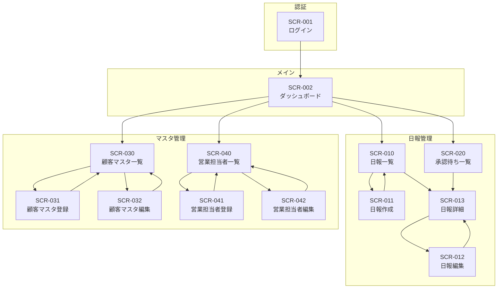

# 営業日報システム 画面定義書

## 1. 画面一覧

| 画面ID  | 画面名               | 概要                           | アクセス権限 |
| ------- | -------------------- | ------------------------------ | ------------ |
| SCR-001 | ログイン             | システムログイン               | 全員         |
| SCR-002 | ダッシュボード       | トップページ、各種サマリー表示 | 全員         |
| SCR-010 | 日報一覧             | 日報の検索・一覧表示           | 全員         |
| SCR-011 | 日報作成             | 新規日報の作成                 | 担当者       |
| SCR-012 | 日報編集             | 日報の編集（下書き・差戻し時） | 担当者       |
| SCR-013 | 日報詳細             | 日報の閲覧・承認・コメント     | 全員         |
| SCR-020 | 承認待ち一覧         | 承認待ち日報の一覧             | 課長・部長   |
| SCR-030 | 顧客マスタ一覧       | 顧客の検索・一覧表示           | 全員         |
| SCR-031 | 顧客マスタ登録       | 顧客の新規登録                 | 課長・部長   |
| SCR-032 | 顧客マスタ編集       | 顧客の編集                     | 課長・部長   |
| SCR-040 | 営業担当者マスタ一覧 | 営業担当者の検索・一覧表示     | 課長・部長   |
| SCR-041 | 営業担当者マスタ登録 | 営業担当者の新規登録           | 部長         |
| SCR-042 | 営業担当者マスタ編集 | 営業担当者の編集               | 部長         |

---

## 2. 画面遷移図



---

## 3. 共通レイアウト

### 3.1 ヘッダー

| 要素           | 説明                                       |
| -------------- | ------------------------------------------ |
| ロゴ           | システムロゴ、クリックでダッシュボードへ   |
| ナビゲーション | 日報管理、承認待ち（上長のみ）、マスタ管理 |
| ユーザー情報   | ログインユーザー名、役職                   |
| ログアウト     | ログアウトボタン                           |

### 3.2 サイドバー

| 要素             | 説明             | 表示条件       |
| ---------------- | ---------------- | -------------- |
| ダッシュボード   | トップページへ   | 常時           |
| 日報一覧         | 日報一覧画面へ   | 常時           |
| 日報作成         | 日報作成画面へ   | 担当者のみ     |
| 承認待ち         | 承認待ち一覧へ   | 課長・部長のみ |
| 顧客マスタ       | 顧客一覧へ       | 常時           |
| 営業担当者マスタ | 営業担当者一覧へ | 課長・部長のみ |

### 3.3 フッター

| 要素         | 説明                    |
| ------------ | ----------------------- |
| コピーライト | © 2024 営業日報システム |
| バージョン   | システムバージョン      |

---

## 4. 画面詳細定義

---

### SCR-001: ログイン

#### 基本情報

| 項目         | 内容           |
| ------------ | -------------- |
| 画面ID       | SCR-001        |
| 画面名       | ログイン       |
| URL          | /login         |
| アクセス権限 | 未認証ユーザー |

#### 画面レイアウト

```
+--------------------------------------------------+
|                                                  |
|              営業日報システム                      |
|                                                  |
|    +----------------------------------------+    |
|    |  メールアドレス                          |    |
|    |  [________________________]             |    |
|    |                                        |    |
|    |  パスワード                             |    |
|    |  [________________________]             |    |
|    |                                        |    |
|    |  [ ] ログイン状態を保持する              |    |
|    |                                        |    |
|    |         [  ログイン  ]                  |    |
|    +----------------------------------------+    |
|                                                  |
+--------------------------------------------------+
```

#### 入力項目

| 項目名             | 項目ID   | 種別             | 必須 | 桁数 | 備考               |
| ------------------ | -------- | ---------------- | ---- | ---- | ------------------ |
| メールアドレス     | email    | テキスト         | ○    | 255  | メール形式チェック |
| パスワード         | password | パスワード       | ○    | 100  | マスク表示         |
| ログイン状態を保持 | remember | チェックボックス | -    | -    | -                  |

#### ボタン

| ボタン名 | 動作                                         |
| -------- | -------------------------------------------- |
| ログイン | 認証処理を実行、成功時はダッシュボードへ遷移 |

#### エラーメッセージ

| コード | メッセージ                                         |
| ------ | -------------------------------------------------- |
| E001   | メールアドレスを入力してください                   |
| E002   | パスワードを入力してください                       |
| E003   | メールアドレスまたはパスワードが正しくありません   |
| E004   | アカウントが無効です。管理者にお問い合わせください |

---

### SCR-002: ダッシュボード

#### 基本情報

| 項目         | 内容               |
| ------------ | ------------------ |
| 画面ID       | SCR-002            |
| 画面名       | ダッシュボード     |
| URL          | /dashboard         |
| アクセス権限 | 全員（ログイン済） |

#### 画面レイアウト

```
+--------------------------------------------------+
| [ヘッダー]                                        |
+--------------------------------------------------+
| [サイド] |                                       |
| [バー]   |  ようこそ、○○さん                      |
|          |                                       |
|          |  +-------------+ +-------------+      |
|          |  | 今月の日報   | | 承認待ち    |      |
|          |  | 作成: 15件   | | 3件         |      |
|          |  | 提出: 12件   | | (課長のみ)  |      |
|          |  +-------------+ +-------------+      |
|          |                                       |
|          |  最近の日報                            |
|          |  +----------------------------------+ |
|          |  | 日付 | ステータス | 訪問件数     | |
|          |  |------|-----------|-------------|  |
|          |  | 1/15 | 承認完了  | 5件         |  |
|          |  | 1/14 | 課長承認済| 3件         |  |
|          |  | 1/13 | 承認完了  | 4件         |  |
|          |  +----------------------------------+ |
|          |                                       |
+--------------------------------------------------+
| [フッター]                                        |
+--------------------------------------------------+
```

#### 表示項目（担当者向け）

| 項目名           | 説明                                        |
| ---------------- | ------------------------------------------- |
| 今月の日報作成数 | 当月に作成した日報の件数                    |
| 今月の日報提出数 | 当月に提出した日報の件数                    |
| 最近の日報       | 直近5件の日報（日付、ステータス、訪問件数） |

#### 表示項目（課長・部長向け）

| 項目名             | 説明                       |
| ------------------ | -------------------------- |
| 承認待ち件数       | 自分が承認すべき日報の件数 |
| 部下の日報提出状況 | 当日の部下の日報提出状況   |

---

### SCR-010: 日報一覧

#### 基本情報

| 項目         | 内容                                                     |
| ------------ | -------------------------------------------------------- |
| 画面ID       | SCR-010                                                  |
| 画面名       | 日報一覧                                                 |
| URL          | /reports                                                 |
| アクセス権限 | 全員（担当者は自分の日報のみ、上長は部下の日報も閲覧可） |

#### 画面レイアウト

```
+--------------------------------------------------+
| [ヘッダー]                                        |
+--------------------------------------------------+
| [サイド] |  日報一覧                    [新規作成] |
| [バー]   |                                       |
|          |  検索条件                              |
|          |  +----------------------------------+ |
|          |  | 期間: [____] 〜 [____]           | |
|          |  | 担当者: [________▼]              | |
|          |  | ステータス: [________▼]          | |
|          |  |        [検索] [クリア]           | |
|          |  +----------------------------------+ |
|          |                                       |
|          |  検索結果: 25件                        |
|          |  +----------------------------------+ |
|          |  | □ |日付|担当者|訪問数|状態|操作 | |
|          |  |---|----|----|-----|----|----|   |
|          |  | □ |1/15|山田|  5  |承認|詳細|   |
|          |  | □ |1/14|山田|  3  |課長|詳細|   |
|          |  | □ |1/13|山田|  4  |承認|詳細|   |
|          |  +----------------------------------+ |
|          |  [< 前へ] 1 2 3 ... 10 [次へ >]       |
+--------------------------------------------------+
| [フッター]                                        |
+--------------------------------------------------+
```

#### 検索条件

| 項目名       | 項目ID         | 種別     | 備考                                          |
| ------------ | -------------- | -------- | --------------------------------------------- |
| 期間（開始） | date_from      | 日付     | カレンダーピッカー                            |
| 期間（終了） | date_to        | 日付     | カレンダーピッカー                            |
| 担当者       | salesperson_id | セレクト | 上長のみ表示                                  |
| ステータス   | status         | セレクト | 全て/下書き/提出済/課長承認済/承認完了/差戻し |

#### 一覧表示項目

| 項目名     | 説明             | ソート |
| ---------- | ---------------- | ------ |
| 選択       | チェックボックス | -      |
| 報告日     | 日報の対象日     | ○      |
| 担当者名   | 日報作成者       | ○      |
| 訪問件数   | 訪問記録の件数   | ○      |
| ステータス | 日報の状態       | ○      |
| 操作       | 詳細ボタン       | -      |

#### ボタン

| ボタン名 | 動作               | 表示条件   |
| -------- | ------------------ | ---------- |
| 新規作成 | 日報作成画面へ遷移 | 担当者のみ |
| 検索     | 検索条件で絞り込み | 常時       |
| クリア   | 検索条件をリセット | 常時       |
| 詳細     | 日報詳細画面へ遷移 | 常時       |

---

### SCR-011: 日報作成

#### 基本情報

| 項目         | 内容         |
| ------------ | ------------ |
| 画面ID       | SCR-011      |
| 画面名       | 日報作成     |
| URL          | /reports/new |
| アクセス権限 | 担当者       |

#### 画面レイアウト

```
+--------------------------------------------------+
| [ヘッダー]                                        |
+--------------------------------------------------+
| [サイド] |  日報作成                              |
| [バー]   |                                       |
|          |  基本情報                              |
|          |  +----------------------------------+ |
|          |  | 報告日: [2024/01/15]             | |
|          |  +----------------------------------+ |
|          |                                       |
|          |  訪問記録                    [＋追加]  |
|          |  +----------------------------------+ |
|          |  | No.1                      [削除] | |
|          |  | 顧客: [________▼]               | |
|          |  | 時刻: [__:__]                    | |
|          |  | 内容: [____________________]     | |
|          |  |       [____________________]     | |
|          |  | 結果: [________▼]               | |
|          |  | 添付: [ファイル選択] file1.pdf   | |
|          |  +----------------------------------+ |
|          |  | No.2                      [削除] | |
|          |  | ...                              | |
|          |  +----------------------------------+ |
|          |                                       |
|          |  課題・相談（Problem）                 |
|          |  +----------------------------------+ |
|          |  | [______________________________] | |
|          |  | [______________________________] | |
|          |  +----------------------------------+ |
|          |                                       |
|          |  明日やること（Plan）                  |
|          |  +----------------------------------+ |
|          |  | [______________________________] | |
|          |  | [______________________________] | |
|          |  +----------------------------------+ |
|          |                                       |
|          |  [下書き保存]  [提出]  [キャンセル]    |
+--------------------------------------------------+
| [フッター]                                        |
+--------------------------------------------------+
```

#### 入力項目

| 項目名       | 項目ID      | 種別           | 必須 | 桁数 | 備考            |
| ------------ | ----------- | -------------- | ---- | ---- | --------------- |
| 報告日       | report_date | 日付           | ○    | -    | デフォルト:当日 |
| 課題・相談   | problem     | テキストエリア | -    | 2000 | 複数行          |
| 明日やること | plan        | テキストエリア | -    | 2000 | 複数行          |

#### 訪問記録（繰り返し）

| 項目名       | 項目ID      | 種別           | 必須 | 桁数 | 備考                               |
| ------------ | ----------- | -------------- | ---- | ---- | ---------------------------------- |
| 顧客         | customer_id | セレクト       | ○    | -    | 顧客マスタから選択                 |
| 訪問時刻     | visit_time  | 時刻           | -    | -    | HH:MM形式                          |
| 訪問内容     | content     | テキストエリア | ○    | 2000 | 複数行                             |
| 結果         | result      | セレクト       | -    | -    | 商談中/成約/見送り/情報収集/その他 |
| 添付ファイル | attachment  | ファイル       | -    | -    | 複数可、10MB以下                   |

#### ボタン

| ボタン名   | 動作                         |
| ---------- | ---------------------------- |
| ＋追加     | 訪問記録の入力欄を追加       |
| 削除       | 該当の訪問記録を削除         |
| 下書き保存 | 下書き状態で保存、一覧へ遷移 |
| 提出       | 提出状態で保存、一覧へ遷移   |
| キャンセル | 確認ダイアログ後、一覧へ遷移 |

#### バリデーション

| チェック内容           | エラーメッセージ                       |
| ---------------------- | -------------------------------------- |
| 報告日が未入力         | 報告日を入力してください               |
| 同一日の日報が既に存在 | この日付の日報は既に存在します         |
| 訪問記録が0件で提出    | 訪問記録を1件以上入力してください      |
| 顧客が未選択           | 顧客を選択してください                 |
| 訪問内容が未入力       | 訪問内容を入力してください             |
| 添付ファイルサイズ超過 | ファイルサイズは10MB以下にしてください |

---

### SCR-012: 日報編集

#### 基本情報

| 項目         | 内容                                          |
| ------------ | --------------------------------------------- |
| 画面ID       | SCR-012                                       |
| 画面名       | 日報編集                                      |
| URL          | /reports/:id/edit                             |
| アクセス権限 | 担当者（自分の日報かつ下書き/差戻し状態のみ） |

#### 画面レイアウト

SCR-011（日報作成）と同様

#### 入力項目

SCR-011（日報作成）と同様

#### 追加表示項目（差戻し時）

| 項目名     | 説明                                         |
| ---------- | -------------------------------------------- |
| 差戻し理由 | 上長が記載した差戻しコメント（読み取り専用） |

---

### SCR-013: 日報詳細

#### 基本情報

| 項目         | 内容                                                     |
| ------------ | -------------------------------------------------------- |
| 画面ID       | SCR-013                                                  |
| 画面名       | 日報詳細                                                 |
| URL          | /reports/:id                                             |
| アクセス権限 | 全員（担当者は自分の日報のみ、上長は部下の日報も閲覧可） |

#### 画面レイアウト

```
+--------------------------------------------------+
| [ヘッダー]                                        |
+--------------------------------------------------+
| [サイド] |  日報詳細                              |
| [バー]   |                                       |
|          |  +----------------------------------+ |
|          |  | 報告日: 2024/01/15               | |
|          |  | 担当者: 山田太郎                  | |
|          |  | ステータス: [提出済]              | |
|          |  | 提出日時: 2024/01/15 18:30       | |
|          |  +----------------------------------+ |
|          |                                       |
|          |  訪問記録                              |
|          |  +----------------------------------+ |
|          |  | ■ 株式会社ABC  10:00             | |
|          |  |   新商品の提案を実施。担当者は    | |
|          |  |   興味を示しており、次回見積...   | |
|          |  |   結果: 商談中                    | |
|          |  |   添付: proposal.pdf [DL]        | |
|          |  |----------------------------------|  |
|          |  | ■ 株式会社XYZ  14:00             | |
|          |  |   定期訪問。特に問題なし。        | |
|          |  |   結果: 情報収集                  | |
|          |  +----------------------------------+ |
|          |                                       |
|          |  課題・相談（Problem）                 |
|          |  +----------------------------------+ |
|          |  | 競合他社の価格攻勢が激しく、     | |
|          |  | 差別化ポイントの整理が必要。     | |
|          |  +----------------------------------+ |
|          |                                       |
|          |  明日やること（Plan）                  |
|          |  +----------------------------------+ |
|          |  | ABC社への見積書作成              | |
|          |  | DEF社へのアポイント取得          | |
|          |  +----------------------------------+ |
|          |                                       |
|          |  承認履歴                              |
|          |  +----------------------------------+ |
|          |  | 2024/01/15 19:00 課長:鈴木 承認  | |
|          |  +----------------------------------+ |
|          |                                       |
|          |  コメント                              |
|          |  +----------------------------------+ |
|          |  | 鈴木課長 2024/01/15 19:05        | |
|          |  | ABC社の件、良い感触ですね。      | |
|          |  | 見積は明日中に確認します。        | |
|          |  +----------------------------------+ |
|          |  | コメントを入力...                 | |
|          |  |              [投稿]              | |
|          |  +----------------------------------+ |
|          |                                       |
|          |  [編集] [承認] [差戻し] [戻る]         |
+--------------------------------------------------+
| [フッター]                                        |
+--------------------------------------------------+
```

#### 表示項目

| 項目名       | 説明                                   |
| ------------ | -------------------------------------- |
| 報告日       | 日報の対象日                           |
| 担当者       | 日報作成者                             |
| ステータス   | 現在の状態（バッジ表示）               |
| 提出日時     | 提出した日時                           |
| 訪問記録     | 顧客名、時刻、内容、結果、添付ファイル |
| 課題・相談   | Problem                                |
| 明日やること | Plan                                   |
| 承認履歴     | 承認・差戻しの履歴                     |
| コメント     | 上長からのコメント一覧                 |

#### ボタン

| ボタン名 | 動作                   | 表示条件                     |
| -------- | ---------------------- | ---------------------------- |
| 編集     | 日報編集画面へ遷移     | 担当者かつ下書き/差戻し状態  |
| 承認     | 承認確認ダイアログ表示 | 課長:提出済、部長:課長承認済 |
| 差戻し   | 差戻しダイアログ表示   | 課長:提出済、部長:課長承認済 |
| 戻る     | 一覧画面へ遷移         | 常時                         |
| 投稿     | コメントを投稿         | 課長・部長のみ               |

#### ダイアログ

**承認確認ダイアログ**

```
+----------------------------------+
|  承認確認                         |
|----------------------------------|
|  この日報を承認しますか？          |
|                                  |
|  コメント（任意）:                |
|  [________________________]      |
|                                  |
|      [キャンセル]  [承認する]     |
+----------------------------------+
```

**差戻しダイアログ**

```
+----------------------------------+
|  差戻し                           |
|----------------------------------|
|  この日報を差戻しますか？          |
|                                  |
|  差戻し理由（必須）:              |
|  [________________________]      |
|  [________________________]      |
|                                  |
|      [キャンセル]  [差戻す]       |
+----------------------------------+
```

---

### SCR-020: 承認待ち一覧

#### 基本情報

| 項目         | 内容         |
| ------------ | ------------ |
| 画面ID       | SCR-020      |
| 画面名       | 承認待ち一覧 |
| URL          | /approvals   |
| アクセス権限 | 課長・部長   |

#### 画面レイアウト

```
+--------------------------------------------------+
| [ヘッダー]                                        |
+--------------------------------------------------+
| [サイド] |  承認待ち一覧                          |
| [バー]   |                                       |
|          |  承認待ち: 5件                         |
|          |  +----------------------------------+ |
|          |  | 日付 | 担当者 | 訪問数 | 操作    | |
|          |  |------|--------|--------|--------|  |
|          |  | 1/15 | 山田   | 5件    | [詳細] |  |
|          |  | 1/15 | 佐藤   | 3件    | [詳細] |  |
|          |  | 1/14 | 山田   | 4件    | [詳細] |  |
|          |  +----------------------------------+ |
+--------------------------------------------------+
| [フッター]                                        |
+--------------------------------------------------+
```

#### 一覧表示項目

| 項目名   | 説明           |
| -------- | -------------- |
| 報告日   | 日報の対象日   |
| 担当者名 | 日報作成者     |
| 訪問件数 | 訪問記録の件数 |
| 提出日時 | 提出した日時   |
| 操作     | 詳細ボタン     |

---

### SCR-030: 顧客マスタ一覧

#### 基本情報

| 項目         | 内容                             |
| ------------ | -------------------------------- |
| 画面ID       | SCR-030                          |
| 画面名       | 顧客マスタ一覧                   |
| URL          | /customers                       |
| アクセス権限 | 全員（閲覧）、課長・部長（編集） |

#### 画面レイアウト

```
+--------------------------------------------------+
| [ヘッダー]                                        |
+--------------------------------------------------+
| [サイド] |  顧客マスタ一覧              [新規登録] |
| [バー]   |                                       |
|          |  検索条件                              |
|          |  +----------------------------------+ |
|          |  | 顧客名: [________________]       | |
|          |  | 業種: [________▼]               | |
|          |  | 状態: [有効のみ▼]               | |
|          |  |        [検索] [クリア]           | |
|          |  +----------------------------------+ |
|          |                                       |
|          |  検索結果: 50件                        |
|          |  +----------------------------------+ |
|          |  | 顧客名 | 業種 | 電話番号 | 操作  | |
|          |  |--------|------|---------|------|  |
|          |  | ABC社  | 製造 | 03-xxxx | 編集 |  |
|          |  | XYZ社  | IT   | 03-xxxx | 編集 |  |
|          |  +----------------------------------+ |
|          |  [< 前へ] 1 2 3 ... 5 [次へ >]        |
+--------------------------------------------------+
| [フッター]                                        |
+--------------------------------------------------+
```

#### 検索条件

| 項目名 | 項目ID    | 種別     | 備考                   |
| ------ | --------- | -------- | ---------------------- |
| 顧客名 | name      | テキスト | 部分一致               |
| 業種   | industry  | セレクト | マスタから選択         |
| 状態   | is_active | セレクト | 全て/有効のみ/無効のみ |

#### 一覧表示項目

| 項目名   | 説明       | ソート |
| -------- | ---------- | ------ |
| 顧客名   | 顧客の名称 | ○      |
| 業種     | 顧客の業種 | ○      |
| 電話番号 | 連絡先     | -      |
| 状態     | 有効/無効  | ○      |
| 操作     | 編集ボタン | -      |

---

### SCR-031: 顧客マスタ登録

#### 基本情報

| 項目         | 内容           |
| ------------ | -------------- |
| 画面ID       | SCR-031        |
| 画面名       | 顧客マスタ登録 |
| URL          | /customers/new |
| アクセス権限 | 課長・部長     |

#### 画面レイアウト

```
+--------------------------------------------------+
| [ヘッダー]                                        |
+--------------------------------------------------+
| [サイド] |  顧客マスタ登録                        |
| [バー]   |                                       |
|          |  +----------------------------------+ |
|          |  | 顧客名 *                          | |
|          |  | [________________________]       | |
|          |  |                                  | |
|          |  | 住所                             | |
|          |  | [________________________]       | |
|          |  |                                  | |
|          |  | 電話番号                          | |
|          |  | [________________________]       | |
|          |  |                                  | |
|          |  | 業種                             | |
|          |  | [________▼]                     | |
|          |  +----------------------------------+ |
|          |                                       |
|          |  [登録]  [キャンセル]                  |
+--------------------------------------------------+
| [フッター]                                        |
+--------------------------------------------------+
```

#### 入力項目

| 項目名   | 項目ID   | 種別     | 必須 | 桁数 | 備考               |
| -------- | -------- | -------- | ---- | ---- | ------------------ |
| 顧客名   | name     | テキスト | ○    | 200  | -                  |
| 住所     | address  | テキスト | -    | 500  | -                  |
| 電話番号 | phone    | テキスト | -    | 20   | 半角数字・ハイフン |
| 業種     | industry | セレクト | -    | -    | マスタから選択     |

---

### SCR-032: 顧客マスタ編集

#### 基本情報

| 項目         | 内容                |
| ------------ | ------------------- |
| 画面ID       | SCR-032             |
| 画面名       | 顧客マスタ編集      |
| URL          | /customers/:id/edit |
| アクセス権限 | 課長・部長          |

#### 入力項目

SCR-031と同様 + 以下

| 項目名     | 項目ID    | 種別   | 必須 | 備考   |
| ---------- | --------- | ------ | ---- | ------ |
| 有効フラグ | is_active | トグル | ○    | ON/OFF |

---

### SCR-040: 営業担当者マスタ一覧

#### 基本情報

| 項目         | 内容                 |
| ------------ | -------------------- |
| 画面ID       | SCR-040              |
| 画面名       | 営業担当者マスタ一覧 |
| URL          | /salespersons        |
| アクセス権限 | 課長・部長           |

#### 画面レイアウト

```
+--------------------------------------------------+
| [ヘッダー]                                        |
+--------------------------------------------------+
| [サイド] |  営業担当者一覧              [新規登録] |
| [バー]   |                                       |
|          |  検索条件                              |
|          |  +----------------------------------+ |
|          |  | 氏名: [________________]         | |
|          |  | 役職: [________▼]               | |
|          |  | 状態: [有効のみ▼]               | |
|          |  |        [検索] [クリア]           | |
|          |  +----------------------------------+ |
|          |                                       |
|          |  検索結果: 20件                        |
|          |  +----------------------------------+ |
|          |  | 氏名 | 役職 | 上長 | メール | 操作| |
|          |  |------|------|-----|-------|----| |
|          |  | 山田 | 担当 | 鈴木 | xxx@  | 編集| |
|          |  | 鈴木 | 課長 | 田中 | xxx@  | 編集| |
|          |  +----------------------------------+ |
+--------------------------------------------------+
| [フッター]                                        |
+--------------------------------------------------+
```

---

### SCR-041: 営業担当者マスタ登録

#### 基本情報

| 項目         | 内容                 |
| ------------ | -------------------- |
| 画面ID       | SCR-041              |
| 画面名       | 営業担当者マスタ登録 |
| URL          | /salespersons/new    |
| アクセス権限 | 部長                 |

#### 入力項目

| 項目名         | 項目ID      | 種別       | 必須 | 桁数 | 備考                       |
| -------------- | ----------- | ---------- | ---- | ---- | -------------------------- |
| 氏名           | name        | テキスト   | ○    | 100  | -                          |
| メールアドレス | email       | テキスト   | ○    | 255  | メール形式、重複不可       |
| 役職           | position_id | セレクト   | ○    | -    | 役職マスタから選択         |
| 直属上長       | manager_id  | セレクト   | -    | -    | 課長を選択（担当者の場合） |
| 2次上長        | director_id | セレクト   | -    | -    | 部長を選択                 |
| 初期パスワード | password    | パスワード | ○    | 100  | 8文字以上                  |

---

### SCR-042: 営業担当者マスタ編集

#### 基本情報

| 項目         | 内容                   |
| ------------ | ---------------------- |
| 画面ID       | SCR-042                |
| 画面名       | 営業担当者マスタ編集   |
| URL          | /salespersons/:id/edit |
| アクセス権限 | 部長                   |

#### 入力項目

SCR-041と同様（パスワードは任意）+ 以下

| 項目名             | 項目ID         | 種別             | 必須 | 備考               |
| ------------------ | -------------- | ---------------- | ---- | ------------------ |
| 有効フラグ         | is_active      | トグル           | ○    | ON/OFF             |
| パスワードリセット | reset_password | チェックボックス | -    | チェック時に初期化 |

---

## 5. 共通メッセージ

### 5.1 確認メッセージ

| コード | メッセージ                               | 使用場面     |
| ------ | ---------------------------------------- | ------------ |
| C001   | 保存してもよろしいですか？               | データ保存時 |
| C002   | 削除してもよろしいですか？               | データ削除時 |
| C003   | 入力内容が破棄されます。よろしいですか？ | キャンセル時 |
| C004   | 提出してもよろしいですか？               | 日報提出時   |
| C005   | 承認してもよろしいですか？               | 承認時       |
| C006   | 差戻ししてもよろしいですか？             | 差戻し時     |

### 5.2 完了メッセージ

| コード | メッセージ             | 使用場面         |
| ------ | ---------------------- | ---------------- |
| I001   | 保存しました           | データ保存完了   |
| I002   | 削除しました           | データ削除完了   |
| I003   | 提出しました           | 日報提出完了     |
| I004   | 承認しました           | 承認完了         |
| I005   | 差戻ししました         | 差戻し完了       |
| I006   | コメントを投稿しました | コメント投稿完了 |

### 5.3 エラーメッセージ

| コード | メッセージ                             | 使用場面       |
| ------ | -------------------------------------- | -------------- |
| E001   | 必須項目を入力してください             | 必須チェック   |
| E002   | 形式が正しくありません                 | 形式チェック   |
| E003   | 権限がありません                       | 権限エラー     |
| E004   | データが見つかりません                 | 存在チェック   |
| E005   | 既に登録されています                   | 重複チェック   |
| E006   | 処理に失敗しました。再度お試しください | システムエラー |
